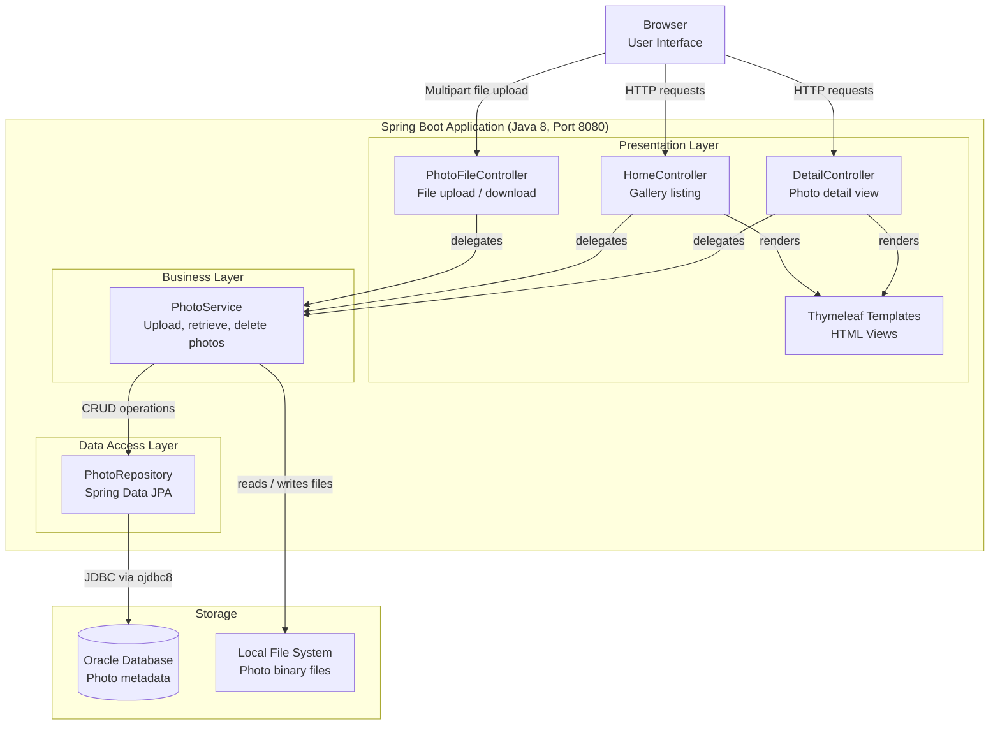

# Architecture Diagram

This diagram illustrates the high-level architecture of the PhotoAlbum Java application, a Spring Boot web application for storing and viewing photo galleries backed by Oracle Database.

## Application Architecture

