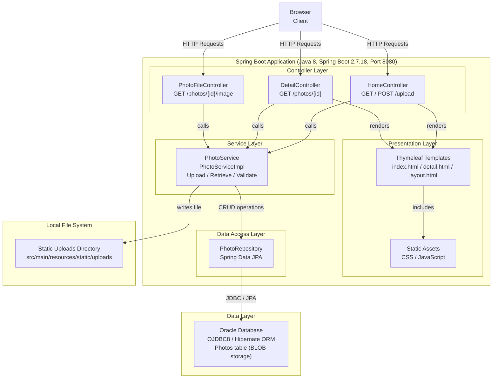

# Architecture Diagram

This diagram illustrates the current architecture of the Photo Album application, a Spring Boot web application for uploading and managing photos backed by an Oracle database.

## Application Architecture

