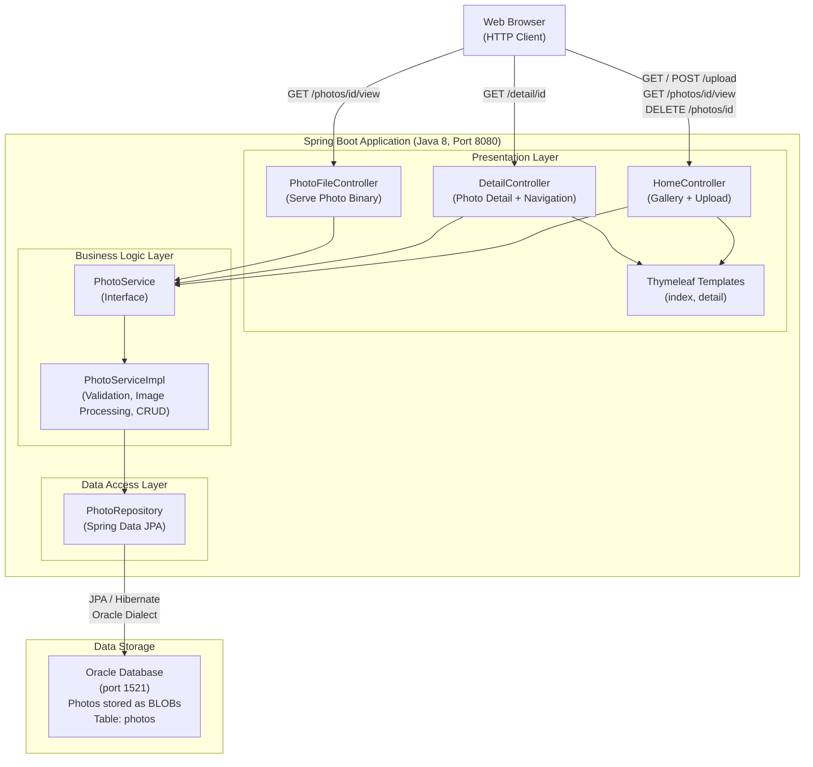

# Photo Album Application - Architecture Diagram

## Architecture Overview

| Layer | Components | Technology |
|---|---|---|
| Presentation | HomeController, DetailController, PhotoFileController | Spring MVC, Thymeleaf |
| Business Logic | PhotoServiceImpl | Spring Service, Java ImageIO |
| Data Access | PhotoRepository | Spring Data JPA, Hibernate |
| Data Storage | Oracle Database | Oracle DB (BLOB storage) |

## Key Technology Stack

- **Runtime**: Java 8
- **Framework**: Spring Boot 2.7.18
- **Templating**: Thymeleaf
- **ORM**: Spring Data JPA / Hibernate (Oracle Dialect)
- **Database**: Oracle Database (JDBC ojdbc8, port 1521)
- **Validation**: Spring Validation (Bean Validation)
- **File Handling**: Commons IO
- **Containerization**: Docker / Docker Compose

## Data Flow

1. **Upload**: Browser uploads image files via `POST /upload` → `HomeController` → `PhotoServiceImpl` validates MIME type and file size, reads binary data and extracts dimensions via Java ImageIO, then saves photo as BLOB to Oracle Database.
2. **Gallery**: Browser requests `GET /` → `HomeController` fetches all photos (metadata) from Oracle → rendered via Thymeleaf `index` template.
3. **View Photo**: Browser requests `GET /photos/{id}/view` → `PhotoFileController` fetches BLOB from Oracle → streams binary data back as HTTP response.
4. **Detail Navigation**: Browser requests `GET /detail/{id}` → `DetailController` fetches photo and adjacent photos for prev/next navigation → rendered via Thymeleaf `detail` template.
